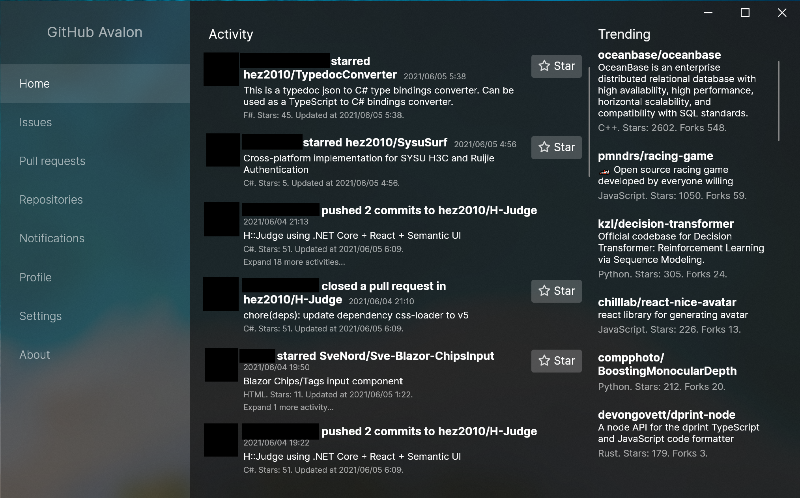

# GitHub Avalon
A cross-platform, brand-new and beautiful GitHub Desktop Client. 

Powered by Avalonia.



## Quick start
Set your personal access token in `config.json` and then you're ready to go!

## Prerequsities for running
None

## Prerequsities for development
- .NET 6 SDK

## Build
```
dotnet build
```

## Run
```
dotnet run
```

## Package
```
dotnet publish -c Release -r win-x64 /p:PublishSingleFile=true /p:PublishTrimmed=true /p:TrimMode=Link
dotnet publish -c Release -r osx-x64 /p:PublishSingleFile=true /p:PublishTrimmed=true /p:TrimMode=Link
dotnet publish -c Release -r linux-x64 /p:PublishSingleFile=true /p:PublishTrimmed=true /p:TrimMode=Link
```
